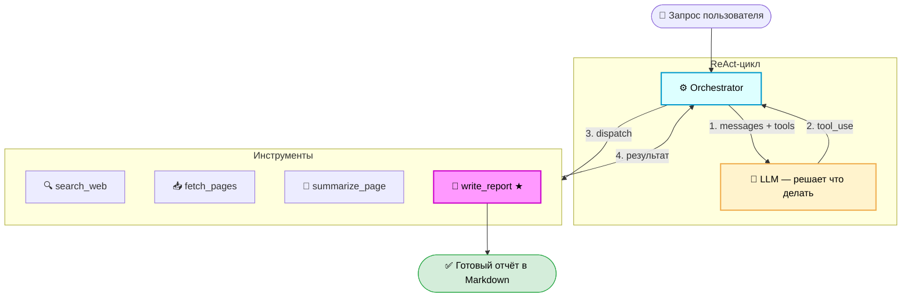

# Research Agent

Автономный CLI-агент для исследования тем: ищет информацию в интернете,
параллельно загружает и суммаризирует страницы, синтезирует структурированный
Markdown-отчёт с источниками.

Проект Модуля 02 курса [AI Agent Roadmap — DataTalks.ru](https://datatalks.ru/ai-agents).

---

## Как это работает

Агент реализует паттерн **ReAct (Reason + Act)**:



LLM сам решает, сколько шагов нужно. Цикл завершается, когда она вызывает
`write_report`, или принудительно после `MAX_STEPS` итераций.

---

## Быстрый старт

**Требования:** Python 3.11+, ключ любого LLM-провайдера. Веб-поиск работает через DuckDuckGo — бесплатно, без ключа.

```bash
# 1. Клонировать и установить
git clone <repo-url>
cd research-agent
python3 -m venv .venv && source .venv/bin/activate
pip install -e ".[dev]"

# 2. Настроить переменные окружения
cp .env.example .env
# Открыть .env, выбрать LLM_PROVIDER и вписать нужный API-ключ

# 3. Запустить агента
python main.py "Лучшие практики построения RAG-систем в 2024"
# или через установленный скрипт:
research-agent "Лучшие практики построения RAG-систем в 2024"
```
Пример заполнения `.env` для **GateLLM** (gatellm.ru — OpenAI-совместимый шлюз):

```env
LLM_PROVIDER=gatellm
GATELLM_API_KEY=sk-44f6008381068c81f0.......................................
DEFAULT_MODEL=qwen/qwen-2.5-72b-instruct

LOG_LEVEL=INFO
MAX_STEPS=10
REQUEST_TIMEOUT=30
REPORTS_DIR=research/
```

> Быстрый старт GateLLM:
> 1. Создайте API-ключ на [gatellm.ru](https://gatellm.ru/) в разделе «API ключи»
> 2. Ключ используется в заголовке `Authorization: Bearer sk-ваш-ключ`
> 3. Эндпоинт: `https://gatellm.ru/v1/` (OpenAI-совместимый)


Пример вывода:

```
╔═══════════════════════════════════════════╗
║  Research Agent  ·  v0.1  ·  DataTalks.ru ║
╚═══════════════════════════════════════════╝

Шаг 1  search_web("RAG best practices 2024")
   → 8 результатов · 0.4 сек

Шаг 2  fetch_pages(["arxiv.org/...", "lilianweng.github.io/..."])
   → 2 страницы параллельно · 1.2 сек

Шаг 3  write_report()
   → Синтезирую отчёт...

# Лучшие практики RAG-систем (2024)
...
```

---

## Поддерживаемые LLM-провайдеры

Агент работает с любым из перечисленных провайдеров. Достаточно одного ключа.

| Провайдер | `LLM_PROVIDER` | Рекомендуемые модели | Регистрация |
|-----------|----------------|----------------------|-------------|
| **Anthropic** | `anthropic` | `claude-sonnet-4-6`, `claude-opus-4-6`, `claude-haiku-4-5` | [console.anthropic.com](https://console.anthropic.com/) |
| **OpenAI** | `openai` | `gpt-4o`, `gpt-4o-mini`, `o1`, `o3-mini` | [platform.openai.com](https://platform.openai.com/api-keys) |
| **OpenRouter** | `openrouter` | `meta-llama/llama-3.3-70b-instruct`, `mistral/mistral-small-3.1-24b`, `google/gemini-2.0-flash-001` | [openrouter.ai](https://openrouter.ai/keys) |
| **DeepSeek** | `deepseek` | `deepseek-chat`, `deepseek-reasoner` | [platform.deepseek.com](https://platform.deepseek.com/api_keys) |
| **Qwen (Alibaba)** | `qwen` | `qwen-plus`, `qwen-turbo`, `qwen-max`, `qwen-long` | [dashscope.aliyuncs.com](https://dashscope.aliyuncs.com/) |
| **MiniMax** | `minimax` | `MiniMax-Text-01` | [minimaxi.chat](https://www.minimaxi.chat/) |
| **Ollama** (локально) | `ollama` | `llama3.2`, `mistral`, `gemma3`, `phi4`, `qwen2.5` | [ollama.com](https://ollama.com/) — бесплатно |
| **GateLLM** | `gatellm` | `qwen/qwen-2.5-72b-instruct`, `meta-llama/llama-3.3-70b-instruct` | [gatellm.ru](https://gatellm.ru/) |
| **Custom** | `custom` | любой OpenAI-совместимый эндпоинт | — |

> **Через OpenRouter** доступно 300+ моделей: Claude, GPT-4o, Llama, Mistral, Gemini, Gemma и другие — по одному ключу.
>
> **GateLLM** — российский OpenAI-совместимый шлюз с доступом к Qwen, Llama и другим открытым моделям.

### Настройка провайдера

Выберите провайдер в `.env`:

```bash
# Вариант 1 — Anthropic (по умолчанию)
LLM_PROVIDER=anthropic
ANTHROPIC_API_KEY=sk-ant-...
DEFAULT_MODEL=claude-sonnet-4-6

# Вариант 2 — DeepSeek (дёшево, сильная модель)
LLM_PROVIDER=deepseek
DEEPSEEK_API_KEY=sk-...
DEFAULT_MODEL=deepseek-chat

# Вариант 3 — Ollama (бесплатно, локально, без ключа)
LLM_PROVIDER=ollama
OLLAMA_BASE_URL=http://localhost:11434
DEFAULT_MODEL=llama3.2
# Установка: ollama pull llama3.2

# Вариант 4 — OpenRouter (300+ моделей по одному ключу)
LLM_PROVIDER=openrouter
OPENROUTER_API_KEY=sk-or-...
DEFAULT_MODEL=meta-llama/llama-3.3-70b-instruct

# Вариант 5 — GateLLM (gatellm.ru — OpenAI-совместимый шлюз)
LLM_PROVIDER=gatellm
GATELLM_API_KEY=sk-44f6008381068c81f0.......................................
DEFAULT_MODEL=qwen/qwen-2.5-72b-instruct

# Вариант 6 — любой OpenAI-совместимый эндпоинт
LLM_PROVIDER=custom
CUSTOM_API_BASE_URL=https://my-llm.example.com/v1
CUSTOM_API_KEY=sk-...
DEFAULT_MODEL=my-model-name
```

---

## Опции командной строки

```bash
python main.py "тема"                                          # базовый запуск
python main.py "тема" --provider deepseek --model deepseek-chat
python main.py "тема" --provider ollama --model llama3.2
python main.py "тема" --provider openrouter --model meta-llama/llama-3.3-70b-instruct
python main.py "тема" --max-steps 15                           # больше шагов
python main.py "тема" --save                                   # сохранить отчёт в research/
python main.py "тема" --verbose                                # DEBUG-лог для отладки

# После pip install -e . доступен короткий алиас:
research-agent "тема" --provider deepseek --save
```

---

## Переменные окружения

Все настройки — в файле `.env` (скопировать из `.env.example`):

| Переменная | По умолчанию | Описание |
|------------|--------------|----------|
| `LLM_PROVIDER` | `anthropic` | Провайдер: `anthropic` / `openai` / `openrouter` / `deepseek` / `qwen` / `minimax` / `ollama` / `gatellm` / `custom` |
| `ANTHROPIC_API_KEY` | — | Ключ Anthropic (нужен при `LLM_PROVIDER=anthropic`) |
| `OPENAI_API_KEY` | — | Ключ OpenAI (нужен при `LLM_PROVIDER=openai`) |
| `OPENROUTER_API_KEY` | — | Ключ OpenRouter |
| `DEEPSEEK_API_KEY` | — | Ключ DeepSeek |
| `QWEN_API_KEY` | — | Ключ Alibaba DashScope |
| `MINIMAX_API_KEY` | — | Ключ MiniMax |
| `OLLAMA_BASE_URL` | `http://localhost:11434` | URL сервера Ollama |
| `GATELLM_API_KEY` | — | Ключ GateLLM (нужен при `LLM_PROVIDER=gatellm`) |
| `CUSTOM_API_BASE_URL` | — | URL любого OpenAI-совместимого эндпоинта |
| `CUSTOM_API_KEY` | — | Ключ для `CUSTOM_API_BASE_URL` |
| `DEFAULT_MODEL` | `claude-sonnet-4-6` | ID модели для выбранного провайдера |
| `MAX_STEPS` | `10` | Максимум шагов ReAct-цикла |
| `REQUEST_TIMEOUT` | `30` | Таймаут HTTP-запросов (сек) |
| `REPORTS_DIR` | `research/` | Папка для сохранения отчётов |
| `LOG_LEVEL` | `INFO` | Уровень логирования |

---

## Структура проекта

```
research-agent/
├── main.py                    # CLI: argparse, точка входа
│
├── agent/
│   ├── orchestrator.py        # ReAct-цикл, счётчик шагов, условие остановки
│   ├── state.py               # AgentState: история сообщений, скрэтчпад, источники
│   └── llm_client.py          # Anthropic SDK: стриминг, retry, бюджет токенов
│
├── tools/
│   ├── registry.py            # Реестр инструментов: JSON Schema + диспетчер
│   ├── search.py              # search_web  → DuckDuckGo (бесплатно, без ключа)
│   ├── fetch.py               # fetch_pages → httpx async + BeautifulSoup
│   ├── summarize.py           # summarize_page → LLM-сжатие
│   └── report.py              # write_report → терминальный инструмент
│
├── config/
│   └── settings.py            # Pydantic Settings, загрузка .env
│
├── ui/
│   └── display.py             # Rich: прогресс, спиннер, Markdown-рендер
│
├── tests/
│   ├── conftest.py            # MockLLMClient, фикстуры
│   ├── test_tools.py          # Юнит-тесты инструментов (mocked HTTP)
│   └── test_agent.py          # Интеграционные тесты цикла (mock LLM)
│
├── research/                  # Сохранённые отчёты (gitignored)
├── CLAUDE.md                  # Инструкции для Claude Code
├── pyproject.toml
└── .env.example
```

---

## Разработка

### Запуск тестов

```bash
pytest tests/ -x -v            # остановиться на первой ошибке
pytest tests/test_tools.py     # только тесты инструментов
pytest tests/test_agent.py     # только интеграционные тесты
```

### Линтер и проверка типов

```bash
ruff check .
mypy agent/ tools/ config/
```

### Добавить новый инструмент

1. Создать `tools/your_tool.py` с `async def your_tool(...) -> ...`
2. Добавить JSON Schema в `TOOL_SCHEMAS` в `tools/registry.py`
3. Зарегистрировать функцию в `TOOL_DISPATCH` в `tools/registry.py`
4. Написать юнит-тест в `tests/test_tools.py` с mocked HTTP

### Отладка зависшего цикла

```bash
LOG_LEVEL=DEBUG python main.py "тема" --max-steps 3
# или:
python main.py "тема" --max-steps 3 --verbose
```

---

## Статус реализации

| Компонент | Статус |
|-----------|--------|
| Скаффолд проекта, CLAUDE.md | ✅ готово |
| `AgentState` — история и источники | ✅ готово |
| `LLMClient` — Anthropic SDK + стриминг | ✅ готово |
| `ToolRegistry` — схемы, регистрация, dispatch | ✅ готово |
| `search_web` — DuckDuckGo (без ключа) | ✅ готово |
| `fetch_pages` — async httpx + BS4 | ✅ готово |
| `summarize_page` — LLM-сжатие | ✅ готово |
| `write_report` — финальный отчёт | ✅ готово |
| `Orchestrator` — ReAct-цикл (5 инвариантов) | ✅ готово |
| `display.py` — Rich UI | ✅ готово |
| Юнит и интеграционные тесты (28/28) | ✅ готово |

---

## Технологии

- **[Anthropic SDK](https://github.com/anthropics/anthropic-sdk-python)** — Claude API, tool calling, стриминг
- **[httpx](https://www.python-httpx.org/)** — async HTTP-клиент для параллельных запросов
- **[BeautifulSoup4](https://www.crummy.com/software/BeautifulSoup/)** — парсинг HTML
- **[Pydantic v2](https://docs.pydantic.dev/)** — валидация настроек и данных
- **[Rich](https://rich.readthedocs.io/)** — красивый терминальный UI
- **[structlog](https://www.structlog.org/)** — структурированное логирование
- **[duckduckgo-search](https://github.com/deedy5/duckduckgo_search)** — бесплатный веб-поиск без API-ключа
- **[pytest](https://pytest.org/) + [respx](https://lundberg.github.io/respx/)** — тесты с mocked HTTP

# Ollama

Если хочешь протестировать прямо сейчас без пополнения — Ollama бесплатна (локально). Нужно только установить и скачать модель:

```
# Установить Ollama: https://ollama.com/
sudo snap install ollama
ollama pull llama3.2
python main.py "RAG best practices" --provider ollama --model llama3.2
```

# Результат работы

```bash
python main.py "RAG best practices" --provider gatellm
╭───────────────────────────────────────────────────────────────────────────────────────────────────────────────────────────────────────────────────────────────────────────────╮
│ Research Agent  ·  v0.1  ·  DataTalks.ru                                                                                                                                      │
│ Provider: gatellm  ·  Model: qwen/qwen-2.5-72b-instruct                                                                                                                       │
╰───────────────────────────────────────────────────────────────────────────────────────────────────────────────────────────────────────────────────────────────────────────────╯
INFO:agent.orchestrator:[info     ] react_step                     [agent.orchestrator] max_steps=10 step=1
INFO:httpx:HTTP Request: POST https://gatellm.ru/v1/chat/completions "HTTP/1.1 200 OK"
INFO:agent.orchestrator:[info     ] tool_dispatched                [agent.orchestrator] input_preview="{'query': 'Retrieval-Augmented Generation best practices', 'max_results': 5}" step=1 tool=search_web
INFO:primp:response: https://en.wikipedia.org/w/api.php?action=opensearch&profile=fuzzy&limit=1&search=Retrieval-Augmented%20Generation%20best%20practices 200
INFO:primp:response: https://grokipedia.com/api/typeahead?query=Retrieval-Augmented+Generation+best+practices&limit=1 200
INFO:primp:response: https://consent.yahoo.com/v2/collectConsent?sessionId=3_cc-session_ea430abb-89a8-4538-85be-15137682677e 200
INFO:primp:response: https://www.mojeek.com/search?q=Retrieval-Augmented+Generation+best+practices 200
INFO:tools.search:[info     ] search_web_done                [tools.search] count=5 query='Retrieval-Augmented Generation best practices'
INFO:agent.orchestrator:[info     ] react_step                     [agent.orchestrator] max_steps=10 step=2
INFO:httpx:HTTP Request: POST https://gatellm.ru/v1/chat/completions "HTTP/1.1 200 OK"
WARNING:agent.orchestrator:[warning  ] end_turn_no_content_retry      [agent.orchestrator] step=2
INFO:agent.orchestrator:[info     ] react_step                     [agent.orchestrator] max_steps=10 step=3
INFO:httpx:HTTP Request: POST https://gatellm.ru/v1/chat/completions "HTTP/1.1 200 OK"
INFO:agent.orchestrator:[info     ] tool_dispatched                [agent.orchestrator] input_preview="{'urls': ['https://aclanthology.org/2025.coling-main.449/', 'https://aclanthology.org/2024.emnlp-main.981/', 'https://ar" step=3 tool=fetch_pages
INFO:httpx:HTTP Request: GET https://arxiv.org/html/2602.03368v2 "HTTP/1.1 200 OK"
INFO:httpx:HTTP Request: GET https://arxiv.org/abs/2407.01219 "HTTP/1.1 200 OK"
INFO:httpx:HTTP Request: GET https://www.chitika.com/rag-challenges-and-solution/ "HTTP/1.1 200 OK"
INFO:httpx:HTTP Request: GET https://aclanthology.org/2024.emnlp-main.981/ "HTTP/1.1 200 OK"
INFO:httpx:HTTP Request: GET https://aclanthology.org/2025.coling-main.449/ "HTTP/1.1 200 OK"
INFO:tools.fetch:[info     ] fetch_pages_done               [tools.fetch] success=5 total=5
INFO:agent.orchestrator:[info     ] react_step                     [agent.orchestrator] max_steps=10 step=4
INFO:httpx:HTTP Request: POST https://gatellm.ru/v1/chat/completions "HTTP/1.1 200 OK"
WARNING:agent.orchestrator:[warning  ] end_turn_no_content_retry      [agent.orchestrator] step=4
INFO:agent.orchestrator:[info     ] react_step                     [agent.orchestrator] max_steps=10 step=5
INFO:httpx:HTTP Request: POST https://gatellm.ru/v1/chat/completions "HTTP/1.1 200 OK"
INFO:agent.orchestrator:[info     ] tool_dispatched                [agent.orchestrator] input_preview='{\'title\': \'Best Practices in Retrieval-Augmented Generation (RAG)\', \'content\': "# Best Practices in Retrieval-Augmented ' step=5 tool=write_report
INFO:tools.report:[info     ] report_written                 [tools.report] sources=5 title='Best Practices in Retrieval-Augmented Generation (RAG)' word_count=700
INFO:agent.orchestrator:[info     ] react_done                     [agent.orchestrator] reason=write_report step=5


──────────────────────────────────────────────────────────────────────────────── Research Report ────────────────────────────────────────────────────────────────────────────────
                                                             Best Practices in Retrieval-Augmented Generation (RAG)                                                              

Retrieval-Augmented Generation (RAG) is a powerful approach that combines retrieval mechanisms with large language models to enhance the accuracy and relevance of generated     
responses. This report outlines best practices for developing and deploying RAG systems, focusing on key components, optimization strategies, and practical considerations.      

Key Components of RAG Systems                                                                                                                                                    

  1 Language Model Size: Larger language models generally provide better performance but at the cost of increased computational resources. Smaller models can be more efficient  
    but may sacrifice some accuracy.                                                                                                                                             
  2 Prompt Design: Carefully crafted prompts can significantly influence the quality of the generated output. Prompts should be clear, concise, and context-aware.               
  3 Document Chunk Size: The size of the retrieved documents or passages can impact performance. Smaller chunks can be processed faster but may lack necessary context. Larger   
    chunks provide more context but can slow down the system.                                                                                                                    
  4 Knowledge Base Size and Structure: The knowledge base should be well-curated and regularly updated to ensure the inclusion of the latest information. Metadata tagging and   
    domain-specific retrieval strategies are crucial for precision.                                                                                                              
  5 Retrieval Stride: The overlap between retrieved documents can affect the quality of the generated output. A higher stride can improve coherence but may increase             
    computational load.                                                                                                                                                          
  6 Query Expansion Techniques: Techniques such as synonyms, paraphrasing, and semantic expansion can enhance the retrieval process and improve the relevance of the results.    
  7 Contrastive In-Context Learning: This approach can help in generating more contextually relevant and accurate responses by leveraging context-aware learning.                
  8 Multilingual Knowledge Bases: Support for multiple languages can expand the applicability of RAG systems, especially in global contexts.                                     
  9 Focus Mode Retrieving: Retrieving relevant context at the sentence level can improve the precision of generated responses.                                                   

Optimization Strategies                                                                                                                                                          

 1 Balancing Performance and Efficiency: RAG systems should strike a balance between contextual richness and generation efficiency. This can be achieved by optimizing the size  
   and structure of the knowledge base, the retrieval mechanisms, and the language model.                                                                                        
 2 Multimodal Retrieval: Integrating visual and textual data can enhance the system's ability to handle complex queries and generate multimedia content.                         
 3 Systematic Evaluation: Conducting extensive experiments and evaluations can help identify the most effective configurations and practices. This includes testing different    
   combinations of components and refining the system based on performance metrics.                                                                                              
 4 Mitigating Hallucinations: RAG systems can reduce the risk of hallucinations by integrating real-time and up-to-date information, reducing reliance on static and potentially 
   biased datasets.                                                                                                                                                              

Practical Considerations                                                                                                                                                         

 1 Scalability: RAG systems should be designed to scale efficiently, handling increasing volumes of data and user queries without significant performance degradation.           
 2 Real-Time Updates: Regular updates to the knowledge base are crucial, especially in domains like healthcare and finance where information changes rapidly.                    
 3 Domain-Specific Adaptation: Customizing RAG systems for specific domains can improve their effectiveness and relevance. For example, in the medical domain, using             
   domain-specific retrieval strategies and curating relevant knowledge bases can enhance the system's performance.                                                              
 4 User Feedback and Iteration: Incorporating user feedback and continuously refining the system based on real-world usage can lead to better outcomes and user satisfaction.    

Conclusion                                                                                                                                                                       

Retrieval-Augmented Generation (RAG) is a promising technology with the potential to revolutionize information retrieval and generation. By following these best practices,      
developers can build more accurate, efficient, and contextually relevant RAG systems tailored to diverse applications and domains.                                               

References:                                                                                                                                                                      

 1 Li, S., Stenzel, L., Eickhoff, C., & Bahrainian, S. A. (2025). Enhancing Retrieval-Augmented Generation: A Study of Best Practices. Proceedings of the 31st International     
   Conference on Computational Linguistics.                                                                                                                                      
 2 Wang, X., Wang, Z., Gao, X., Zhang, F., Wu, Y., Xu, Z., ... & Huang, X. (2024). Searching for Best Practices in Retrieval-Augmented Generation. Proceedings of the 2024       
   Conference on Empirical Methods in Natural Language Processing.                                                                                                               
 3 Li, L., & Zhu, W. (2026). Pursuing Best Industrial Practices for Retrieval-Augmented Generation in the Medical Domain. ArXiv.                                                 
 4 Chitika. (n.d.). Retrieval-Augmented Generation: Challenges & Solutions. Chitika.                                                                                             

References                                                                                                                                                                       

 1 Enhancing Retrieval-Augmented Generation: A Study of Best Practices - ACL Anthology                                                                                           
 2 Searching for Best Practices in Retrieval-Augmented Generation - ACL Anthology                                                                                                
 3 [2407.01219] Searching for Best Practices in Retrieval-Augmented Generation                                                                                                   
 4 Pursuing Best Industrial Practices for Retrieval-Augmented Generation in the Medical Domain                                                                                   
 5 Retrieval-Augmented Generation: Challenges & Solutions                                                                                                                        


                                                            Sources                                                            
┏━━━━━┳━━━━━━━━━━━━━━━━━━━━━━━━━━━━━━━━━━━━━━━━━━━━━━━━━━━━━━━━━━━━━━━━┳━━━━━━━━━━━━━━━━━━━━━━━━━━━━━━━━━━━━━━━━━━━━━━━━━━━━━━┓
┃ #   ┃ Title                                                          ┃ URL                                                  ┃
┡━━━━━╇━━━━━━━━━━━━━━━━━━━━━━━━━━━━━━━━━━━━━━━━━━━━━━━━━━━━━━━━━━━━━━━━╇━━━━━━━━━━━━━━━━━━━━━━━━━━━━━━━━━━━━━━━━━━━━━━━━━━━━━━┩
│ 1   │ Enhancing Retrieval-Augmented Generation: A Study of Best      │ https://aclanthology.org/2025.coling-main.449/       │
│ 2   │ Searching for Best Practices in Retrieval-Augmented Generation │ https://aclanthology.org/2024.emnlp-main.981/        │
│ 3   │ [2407.01219] Searching for Best Practices in                   │ https://arxiv.org/abs/2407.01219                     │
│ 4   │ Pursuing Best Industrial Practices for Retrieval-Augmented     │ https://arxiv.org/html/2602.03368v2                  │
│ 5   │ Retrieval-Augmented Generation: Challenges & Solutions         │ https://www.chitika.com/rag-challenges-and-solution/ │
└─────┴────────────────────────────────────────────────────────────────┴──────────────────────────────────────────────────────┘

Steps: 5  ·  Sources: 5  ·  Messages: 11
```