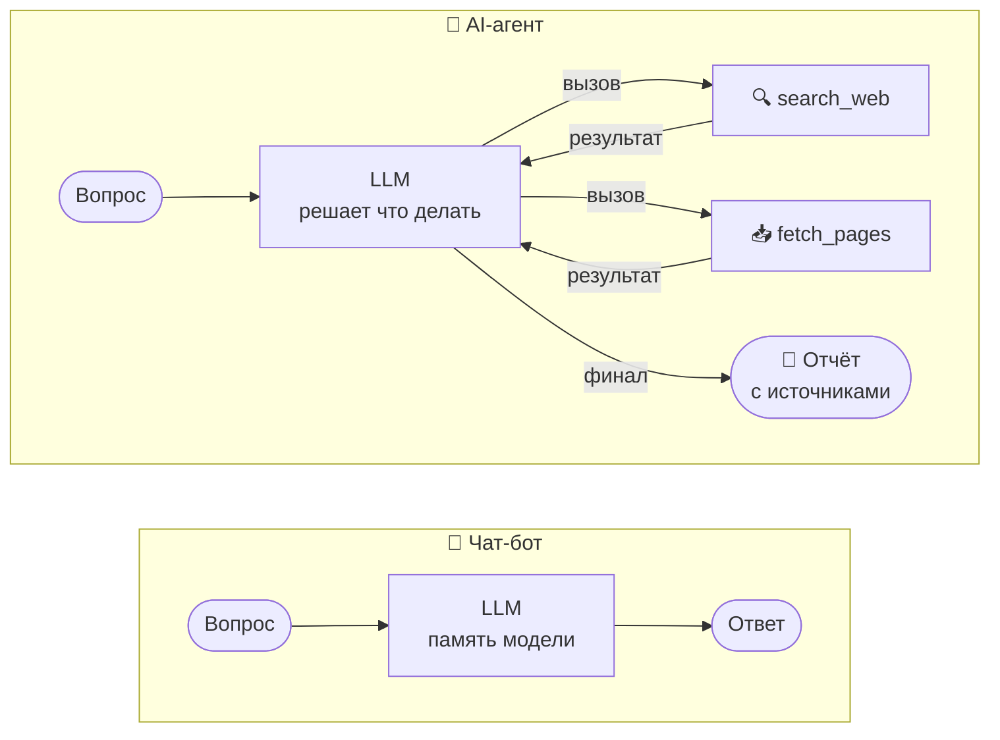
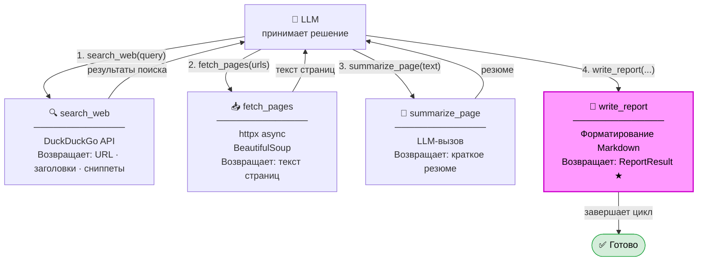
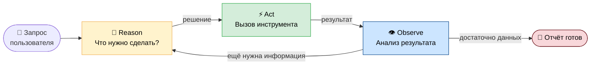

# Урок 0. Концепции: что такое AI-агент и паттерн ReAct

## Что такое AI-агент

Обычный чат-бот отвечает на вопрос напрямую из памяти модели. Он ограничен
тем, что знал на момент обучения, и не может обращаться к внешним источникам.

**AI-агент** устроен принципиально иначе. Вместо того чтобы сразу давать ответ,
агент принимает решения о том, *какие действия нужно совершить*, выполняет их,
смотрит на результат и решает, что делать дальше. Это называется **автономным
циклом управления**.



Ключевое отличие — агент **использует инструменты** и **итерирует** до тех пор,
пока не получит нужный результат.

---

## Что такое инструменты (tools)

Инструменты — это Python-функции, которые агент может вызывать. LLM не исполняет
код сама: она лишь *говорит*, какую функцию вызвать и с какими аргументами.
Ваш код вызывает функцию и возвращает результат обратно модели.

В нашем агенте четыре инструмента:

| Инструмент | Что делает |
|------------|-----------|
| `search_web` | Ищет в DuckDuckGo, возвращает список URL |
| `fetch_pages` | Загружает страницы по URL, извлекает текст |
| `summarize_page` | Сжимает длинный текст до ключевых тезисов |
| `write_report` | Формирует финальный отчёт — завершает сессию |



---

## Паттерн ReAct

ReAct расшифровывается как **Re**asoning + **Act**ing — рассуждение и действие.
Это паттерн организации цикла работы агента, предложенный в исследовательской
работе Google и Принстона в 2022 году.

### Идея

На каждом шаге агент делает три вещи:

1. **Reason (думает)** — «что я знаю, чего не хватает, что нужно сделать»
2. **Act (действует)** — вызывает инструмент
3. **Observe (наблюдает)** — получает результат и снова думает



### Пример шага

**Шаг 1 — Reason:**
```
Пользователь спросил о RAG. Мне нужно найти актуальную информацию.
Лучший первый шаг — поиск в интернете.
```

**Act:**
```python
search_web(query="RAG best practices 2024", max_results=5)
```

**Observe:**
```json
[
  {"url": "https://arxiv.org/...", "title": "RAG Survey", "snippet": "..."},
  {"url": "https://example.com/...", "title": "RAG Guide", "snippet": "..."}
]
```

**Шаг 2 — Reason:**
```
Нашёл 5 источников. Нужно загрузить содержимое 2-3 самых перспективных.
```

**Act:**
```python
fetch_pages(urls=["https://arxiv.org/...", "https://example.com/..."])
```

И так далее, пока LLM не решит, что информации достаточно, и не вызовет
`write_report`.

---

## Почему это работает

Современные LLM умеют рассуждать о том, что им нужно узнать и как это узнать.
Паттерн ReAct использует эту способность структурированно:

- **Нет галлюцинаций по фактам** — агент проверяет реальные источники
- **Адаптивность** — если один поиск дал мало результатов, агент уточняет запрос
- **Прозрачность** — каждое действие видно в логах

---

## Ограничения

- **Стоимость** — каждый шаг = один LLM-вызов = деньги или время
- **Детерминизм** — агент может принять неожиданное решение
- **Зацикливание** — без лимита шагов (`MAX_STEPS`) агент может ходить по кругу

Именно поэтому в нашем оркестраторе есть жёсткий лимит шагов и условие
завершения через `write_report`. Подробнее об этом — в уроке по Orchestrator.

---

## Что дальше

Следующий шаг — посмотреть, как все эти концепции переводятся в архитектуру
реального проекта: [02-architecture.md](02-architecture.md)
