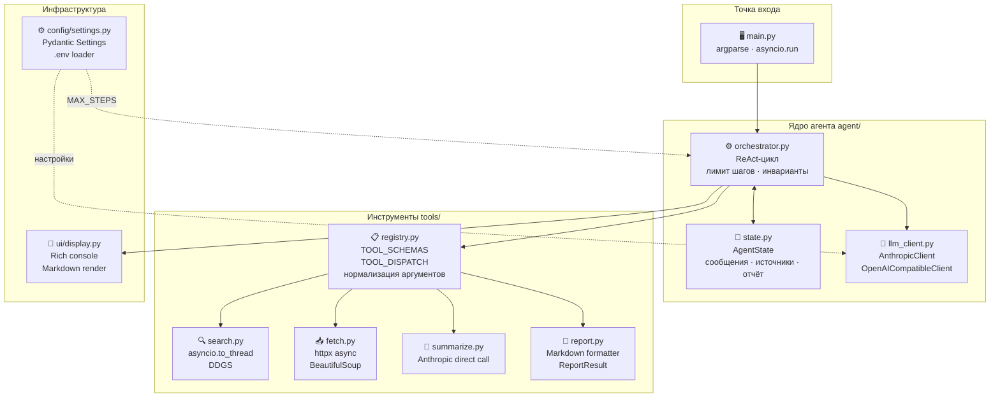
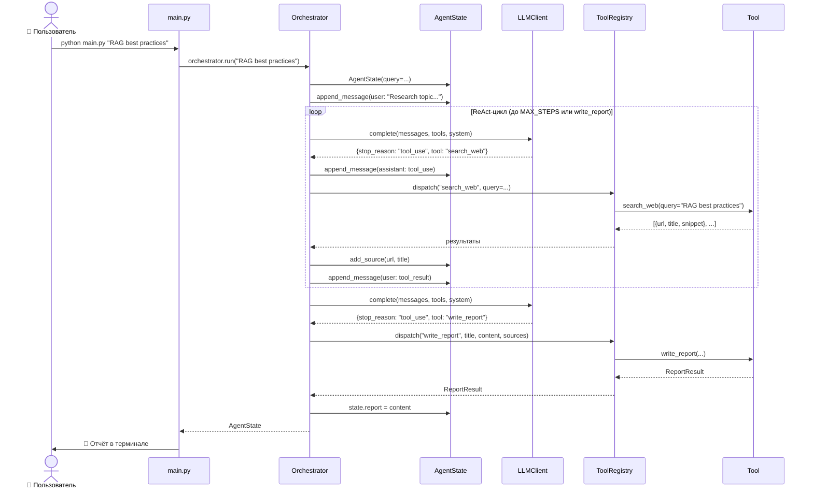

# Урок 0.2. Архитектура проекта

## Карта компонентов



Каждый компонент отвечает за одну вещь — это принцип единственной
ответственности (Single Responsibility). Благодаря этому каждый модуль
можно тестировать и менять независимо.

---

## Поток данных: что происходит при одном запросе



Разберём по шагам, что происходит когда вы запускаете:

```bash
python main.py "RAG best practices"
```

### Шаг 1 — CLI разбирает аргументы

`main.py` получает запрос, создаёт LLM-клиент и Orchestrator, запускает
`orchestrator.run("RAG best practices")`.

### Шаг 2 — Orchestrator инициализирует состояние

```python
state = AgentState(query="RAG best practices")
state.append_message(Message(role="user", content="Research topic: RAG best practices"))
```

`AgentState` — это «память» сессии. В ней хранится вся история переписки,
найденные источники и итоговый отчёт.

### Шаг 3 — Первый вызов LLM

Orchestrator отправляет историю сообщений и список доступных инструментов в LLM:

```python
response = await llm.complete(
    messages=state.to_api_messages(),
    tools=registry.get_schemas(),
    system=SYSTEM_PROMPT,
)
```

LLM видит инструменты (как функции с описанием) и решает, что нужно вызвать
`search_web`.

### Шаг 4 — Dispatch инструмента

LLM возвращает блок `tool_use`:

```json
{
  "type": "tool_use",
  "name": "search_web",
  "input": {"query": "RAG best practices 2024", "max_results": 5}
}
```

Orchestrator передаёт это в `ToolRegistry.dispatch()`, который находит
нужную функцию и вызывает её.

### Шаг 5 — Результат возвращается в контекст

Результат `search_web` добавляется в историю как сообщение от `user`:

```json
{
  "role": "user",
  "content": [{"type": "tool_result", "tool_use_id": "...", "content": "[...]"}]
}
```

Это стандарт Anthropic API — результаты инструментов передаются как
пользовательские сообщения, чтобы LLM видела их при следующем вызове.

### Шаг 6 — Цикл продолжается

Orchestrator снова вызывает LLM с обновлённой историей. LLM видит результаты
поиска и решает загрузить несколько страниц (`fetch_pages`). После загрузки —
снова вызов LLM. И так до тех пор, пока LLM не вызывает `write_report`.

### Шаг 7 — Завершение

Когда LLM вызывает `write_report`, Orchestrator:
1. Вызывает функцию `write_report` с переданным контентом
2. Сохраняет отчёт в `state.report`
3. **Немедленно** выходит из цикла

После этого `main.py` получает `state` и передаёт его в `ui/display.py`
для красивого вывода в терминал.

---

## Почему именно такая структура

### Почему AgentState отдельно от Orchestrator

Состояние (данные) и логика (что делать с данными) должны быть разделены.
Это упрощает тестирование: можно проверить `AgentState` без запуска цикла,
и проверить цикл с фиктивным состоянием.

### Почему ToolRegistry отдельно от инструментов

Оркестратор не знает о конкретных инструментах напрямую — он знает только
`ToolRegistry`. Это значит:
- Можно добавить новый инструмент, не трогая Orchestrator
- Можно тестировать диспетчер отдельно

### Почему LLMClient отдельно

LLM-клиент — это единственное место, где происходит общение с API.
Если завтра появится новый провайдер — меняем только клиент,
оркестратор не знает разницы.

---

## Структура файлов

```
research-agent/
├── main.py                    # Точка входа, CLI
│
├── agent/
│   ├── orchestrator.py        # ReAct-цикл
│   ├── state.py               # Память сессии
│   └── llm_client.py          # Работа с LLM API
│
├── tools/
│   ├── registry.py            # Каталог инструментов
│   ├── search.py              # Поиск в DuckDuckGo
│   ├── fetch.py               # Загрузка страниц
│   ├── summarize.py           # Суммаризация текста
│   └── report.py              # Финальный отчёт
│
├── config/
│   └── settings.py            # Настройки через .env
│
├── ui/
│   └── display.py             # Вывод в терминал (Rich)
│
└── tests/
    ├── conftest.py            # Общие фикстуры
    ├── test_tools.py          # Юнит-тесты инструментов
    └── test_agent.py          # Интеграционные тесты цикла
```

---

## Что дальше

Прежде чем смотреть на код — настроим окружение:
[03-setup.md](03-setup.md)
