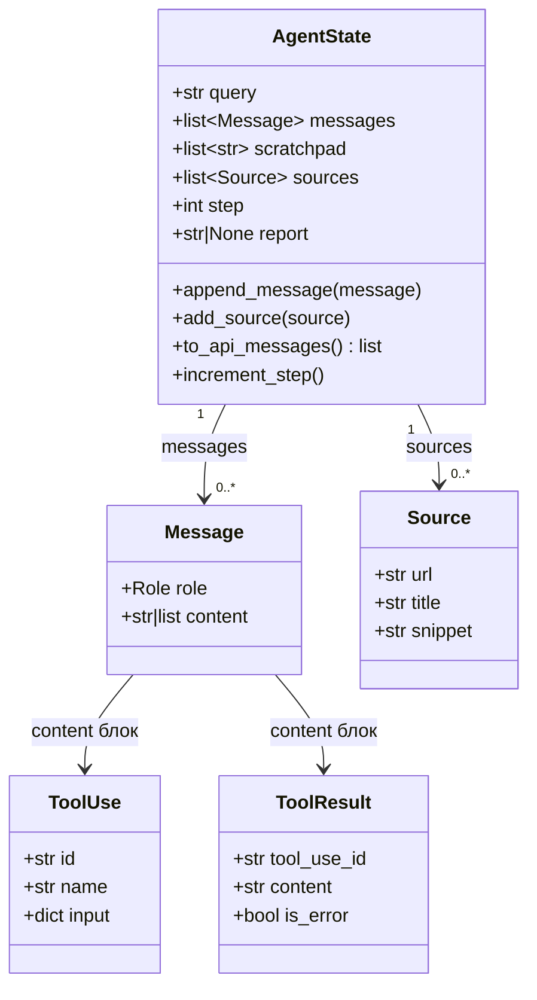

# Урок 1. Память агента — AgentState

**Файл:** `agent/state.py`

## Зачем нужно состояние

LLM сама по себе не помнит ничего между вызовами. Каждый раз вы отправляете
ей сообщения заново — как если бы разговор начинался с чистого листа.

Задача `AgentState` — хранить всё, что происходит в течение сессии:
- Историю переписки (какие инструменты вызывались, что вернули)
- Список найденных источников
- Готовый отчёт
- Счётчик шагов

Это **единственный источник истины** для сессии. Все компоненты читают
из него и пишут в него.

---

## Структуры данных

Прежде чем смотреть на `AgentState`, разберём вспомогательные датаклассы.

### Что такое dataclass

Датакласс (dataclass) — это удобный способ создать класс только для хранения
данных. Python автоматически создаёт `__init__`, `__repr__` и другие методы.

```python
from dataclasses import dataclass

@dataclass
class Person:
    name: str
    age: int

p = Person(name="Иван", age=30)
print(p)  # Person(name='Иван', age=30)
```

### Message — одно сообщение в истории

```python
@dataclass
class Message:
    role: Role                   # "user" или "assistant"
    content: str | list[Any]    # текст или список блоков (tool_use / tool_result)
```

Почему `content` может быть списком? Потому что Anthropic API передаёт
инструменты в виде специальных блоков, не простого текста:

```python
# Простое сообщение пользователя:
Message(role="user", content="Research topic: RAG")

# Ответ ассистента с вызовом инструмента:
Message(role="assistant", content=[
    {"type": "tool_use", "id": "tu_001", "name": "search_web",
     "input": {"query": "RAG best practices"}}
])

# Результат инструмента (передаётся как сообщение от user):
Message(role="user", content=[
    {"type": "tool_result", "tool_use_id": "tu_001",
     "content": "[{\"url\": \"...\", \"title\": \"...\"}]"}
])
```

### Source — один источник

```python
@dataclass
class Source:
    url: str
    title: str
    snippet: str = ""    # краткое описание (не обязательно)
```

---

## Структура данных



## AgentState — главный класс

```python
@dataclass
class AgentState:
    query: str                          # исходный запрос пользователя
    messages: list[Message] = field(default_factory=list)
    scratchpad: list[str]  = field(default_factory=list)
    sources: list[Source]  = field(default_factory=list)
    step: int = 0
    report: str | None = None
```

### Важный момент: `field(default_factory=list)`

Это может выглядеть странно. Почему не просто `messages: list = []`?

Потому что в Python изменяемые объекты (list, dict) как значения по умолчанию
**разделяются между всеми экземплярами класса**. Это классическая ловушка:

```python
# НЕПРАВИЛЬНО — все экземпляры делят один список!
@dataclass
class Bad:
    items: list = []

a = Bad()
b = Bad()
a.items.append(1)
print(b.items)   # [1] — катастрофа!

# ПРАВИЛЬНО — каждый экземпляр получает свой список
@dataclass
class Good:
    items: list = field(default_factory=list)

a = Good()
b = Good()
a.items.append(1)
print(b.items)   # [] — всё правильно
```

---

## Методы AgentState

### append_message — добавить сообщение

```python
def append_message(self, message: Message) -> None:
    self.messages.append(message)
```

Выглядит тривиально, но важен принцип: **состояние только растёт**.
Мы никогда не удаляем и не изменяем существующие сообщения.
Это один из ключевых инвариантов ReAct-цикла.

Зачем? LLM видит полную историю. Если мы удалим сообщение, модель
«потеряет» контекст и может начать повторять уже сделанное.

### add_source — добавить источник без дублей

```python
def add_source(self, source: Source) -> None:
    if not any(s.url == source.url for s in self.sources):
        self.sources.append(source)
```

Агент может найти один и тот же URL несколько раз (при разных поисках).
Этот метод проверяет, не добавлен ли уже источник с таким URL.

### to_api_messages — конвертация для API

```python
def to_api_messages(self) -> list[dict[str, Any]]:
    return [{"role": msg.role, "content": msg.content} for msg in self.messages]
```

API Anthropic ожидает список словарей вида `{"role": ..., "content": ...}`.
Этот метод конвертирует наши объекты `Message` в нужный формат.

### increment_step

```python
def increment_step(self) -> None:
    self.step += 1
```

Счётчик шагов используется для:
1. Ограничения количества итераций (`step < max_steps`)
2. Логирования (`step=3`)

---

## Как это выглядит в процессе работы агента

После трёх шагов работы агента `AgentState` может выглядеть так:

```
AgentState(
    query="RAG best practices",
    step=3,
    messages=[
        Message(role="user", content="Research topic: RAG best practices"),
        Message(role="assistant", content=[{"type": "tool_use", "name": "search_web", ...}]),
        Message(role="user", content=[{"type": "tool_result", "content": "[...]"}]),
        Message(role="assistant", content=[{"type": "tool_use", "name": "fetch_pages", ...}]),
        Message(role="user", content=[{"type": "tool_result", "content": "[...]"}]),
        Message(role="assistant", content=[{"type": "tool_use", "name": "write_report", ...}]),
        Message(role="user", content=[{"type": "tool_result", "content": "Report written"}]),
    ],
    sources=[
        Source(url="https://arxiv.org/...", title="RAG Survey"),
        Source(url="https://example.com/...", title="RAG Guide"),
    ],
    report="# RAG Best Practices\n\n..."
)
```

---

## Проверить самостоятельно

```python
from agent.state import AgentState, Message, Source

# Создать состояние
state = AgentState(query="RAG best practices")

# Добавить сообщения
state.append_message(Message(role="user", content="Research topic: RAG"))
state.append_message(Message(role="assistant", content="Let me search for that."))
state.increment_step()

# Добавить источники (дубли не добавятся)
state.add_source(Source(url="https://arxiv.org/1", title="Paper 1"))
state.add_source(Source(url="https://arxiv.org/1", title="Paper 1"))  # дубль!
state.add_source(Source(url="https://arxiv.org/2", title="Paper 2"))

print(f"Шагов: {state.step}")          # 1
print(f"Сообщений: {len(state.messages)}")  # 2
print(f"Источников: {len(state.sources)}")  # 2 (дубль отфильтрован)
print(state)
```

---

## Что дальше

Состояние есть. Теперь нужно научить агента разговаривать с LLM:
[05-llm-client.md](05-llm-client.md)
