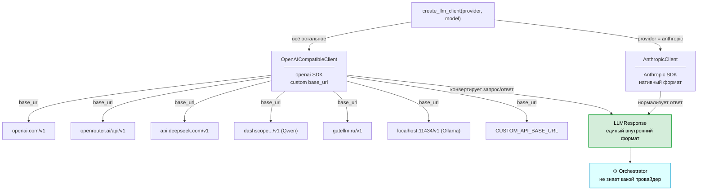

# Урок 2. Клиент языковой модели — LLMClient

**Файл:** `agent/llm_client.py`

## Задача модуля

LLM-клиент — единственное место в проекте, где происходит
непосредственное общение с API языковой модели. Это называется
**точкой интеграции** (integration point).

Все остальные компоненты (Orchestrator, инструменты) не знают,
с каким именно провайдером работает агент. Они просто вызывают
`client.complete(messages, tools)` и получают ответ.

Такой подход называется **инверсия зависимостей** (dependency inversion):
компоненты зависят от абстракции (интерфейса), а не от конкретной реализации.

---

## Интерфейс — LLMClientProtocol

```python
class LLMClientProtocol(Protocol):
    async def complete(
        self,
        messages: list[dict[str, Any]],
        tools: list[ToolSchema],
        system: str = "",
    ) -> LLMResponse:
        ...

    async def stream(
        self,
        messages: list[dict[str, Any]],
        tools: list[ToolSchema],
        system: str = "",
    ) -> AsyncIterator[str]:
        ...
```

### Что такое Protocol

`Protocol` из модуля `typing` — это Python-способ описать интерфейс
(как `interface` в Java или TypeScript). Любой класс, у которого есть
методы с такими же сигнатурами, автоматически считается совместимым,
даже без явного наследования.

Это позволяет в тестах использовать `MockLLMClient` вместо реального,
и Orchestrator не заметит разницы.

### Нормализованный формат ответа

Все клиенты возвращают ответ в едином внутреннем формате (Anthropic-style),
даже если используется OpenAI-совместимый провайдер:

```python
{
    "id": "msg_001",
    "type": "message",
    "role": "assistant",
    "content": [
        {"type": "text", "text": "Сначала поищу информацию."},
        {
            "type": "tool_use",
            "id": "tu_001",
            "name": "search_web",
            "input": {"query": "RAG best practices 2024"}
        }
    ],
    "stop_reason": "tool_use",   # или "end_turn"
    "usage": {"input_tokens": 150, "output_tokens": 30}
}
```

---

## Архитектура мультипровайдерности



## AnthropicClient

```python
class AnthropicClient:
    def __init__(self, model=None, max_retries=3, max_tokens=4096):
        self.model = model or settings.DEFAULT_MODEL
        ...

    async def complete(self, messages, tools, system="") -> LLMResponse:
        client = self._get_client()
        trimmed = _trim_history(messages)

        response = await client.messages.create(
            model=self.model,
            max_tokens=self.max_tokens,
            messages=trimmed,
            tools=tools,
            system=system,
        )

        # Конвертируем SDK-объект в наш словарь
        content = []
        for block in response.content:
            if block.type == "tool_use":
                content.append({"type": "tool_use", "id": block.id,
                                 "name": block.name, "input": block.input})
            elif block.type == "text":
                content.append({"type": "text", "text": block.text})

        return {"content": content, "stop_reason": response.stop_reason, ...}
```

### Почему `_get_client()` вместо создания в `__init__`

Клиент Anthropic создаётся лениво (lazy initialization) — только при первом
вызове. Это нужно для тестов: если бы клиент создавался в `__init__`,
то при импорте модуля сразу проверялся бы ключ API, что ломает тесты.

---

## OpenAICompatibleClient

Большинство современных LLM-провайдеров (DeepSeek, Qwen, GateLLM, Ollama,
OpenRouter) реализуют **OpenAI API** — один и тот же стандарт.
Это значит, что для всех них нужен только один клиент.

```python
class OpenAICompatibleClient:
    def __init__(self, provider, model=None, ...):
        self.provider = provider
        ...
```

### Как работает мультипровайдерность

```python
_PROVIDER_BASE_URLS = {
    "openai":     "https://api.openai.com/v1",
    "openrouter": "https://openrouter.ai/api/v1",
    "deepseek":   "https://api.deepseek.com/v1",
    "qwen":       "https://dashscope.aliyuncs.com/compatible-mode/v1",
    "gatellm":    "https://gatellm.ru/v1",
    "ollama":     "",  # берётся из OLLAMA_BASE_URL
    "custom":     "",  # берётся из CUSTOM_API_BASE_URL
    ...
}
```

Клиент просто меняет `base_url` и ключ — всё остальное одинаково.
Это мощь стандартизации API.

---

## Конвертация форматов (ключевая часть)

Anthropic и OpenAI используют разные форматы сообщений. `OpenAICompatibleClient`
конвертирует туда и обратно прозрачно для Orchestrator.

### Anthropic → OpenAI (запрос)

**Инструменты:**

```python
# Anthropic format (наш внутренний):
{
    "name": "search_web",
    "description": "Search the web...",
    "input_schema": {
        "type": "object",
        "properties": {"query": {"type": "string", "description": "..."}}
    }
}

# OpenAI format (что отправляем провайдеру):
{
    "type": "function",
    "function": {
        "name": "search_web",
        "description": "Search the web...",
        "parameters": {
            "type": "object",
            "properties": {"query": {"type": "string", "description": "..."}}
        }
    }
}
```

**Результаты инструментов:**

```python
# Anthropic: результат = сообщение от user с блоком tool_result
{"role": "user", "content": [{"type": "tool_result", "tool_use_id": "tu_001", ...}]}

# OpenAI: отдельное сообщение с role="tool"
{"role": "tool", "tool_call_id": "tu_001", "content": "...результат..."}
```

Это тонкое различие — именно из-за него нельзя просто взять Anthropic-клиент
и отправить запрос в OpenAI-совместимый API.

### OpenAI → Anthropic (ответ)

```python
# OpenAI finish_reason → Anthropic stop_reason:
"stop"       → "end_turn"
"tool_calls" → "tool_use"
"length"     → "max_tokens"
```

---

## Бюджет токенов — _trim_history

LLM имеет ограниченное контекстное окно. Если история сообщений
становится слишком длинной, API вернёт ошибку.

```python
def _trim_history(messages, max_tokens=80_000):
    if _estimate_tokens(messages) <= max_tokens:
        return messages

    # Оставляем первое сообщение (исходный запрос)
    trimmed = [messages[0]] + messages[1:]
    while len(trimmed) > 2 and _estimate_tokens(trimmed) > max_tokens:
        trimmed.pop(1)   # удаляем второе сообщение (самое старое)
    return trimmed
```

Стратегия: всегда сохранять первое сообщение (запрос пользователя),
а самые старые промежуточные сообщения удалять при необходимости.

`_estimate_tokens` — простая эвристика: `len(str(messages)) // 4`.
Это не точно (реальный tokenizer считает иначе), но достаточно для защиты
от переполнения контекста.

---

## Фабрика — create_llm_client

```python
def create_llm_client(provider=None, model=None) -> LLMClientProtocol:
    p = provider or settings.LLM_PROVIDER

    if p == "anthropic":
        return AnthropicClient(model=model)

    if p in _PROVIDER_BASE_URLS:
        return OpenAICompatibleClient(provider=p, model=model)

    raise ValueError(f"Unknown provider: {p!r}")
```

Функция-фабрика создаёт нужный клиент в зависимости от провайдера.
`main.py` и тесты используют только её — не создают клиентов напрямую.

---

## Retry при rate limit

Если провайдер возвращает ошибку `rate_limit`, клиент автоматически
повторяет запрос с экспоненциальной задержкой:

```python
for attempt in range(self.max_retries):  # 3 попытки
    try:
        return await client.chat.completions.create(...)
    except Exception as e:
        if "rate_limit" in str(e).lower() and attempt < max_retries - 1:
            wait = 2 ** attempt   # 1 сек, 2 сек, 4 сек...
            await asyncio.sleep(wait)
        else:
            raise
```

---

## Что дальше

Клиент умеет общаться с LLM. Теперь нужны инструменты, которые она
будет вызывать: [06-tools.md](06-tools.md)
