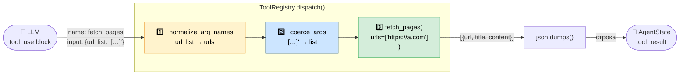

# Урок 4. Реестр инструментов — ToolRegistry

**Файл:** `tools/registry.py`

## Зачем нужен реестр

LLM не знает о ваших Python-функциях напрямую. Она знает только то,
что вы ей описали. Перед каждым вызовом LLM вы передаёте список доступных
инструментов в виде JSON-схем — и модель выбирает нужную.

`ToolRegistry` решает две задачи:
1. Хранит JSON-схемы всех инструментов для передачи в LLM
2. Диспетчеризует вызовы — по имени инструмента находит нужную функцию

---

## JSON Schema — описание инструмента для LLM

Каждый инструмент описывается схемой в формате Anthropic API:

```python
{
    "name": "search_web",
    "description": (
        "Search the internet for information on a topic. "
        "Returns a list of relevant URLs with titles and snippets. "
        "Use this first to discover sources."
    ),
    "input_schema": {
        "type": "object",
        "properties": {
            "query": {
                "type": "string",
                "description": "The search query string. Be specific and include key terms.",
            },
            "max_results": {
                "type": "integer",
                "description": "Maximum number of results to return (1-10). Default: 5.",
                "default": 5,
            },
        },
        "required": ["query"],    # ← обязательные аргументы
    },
}
```

### Почему description так важен

LLM читает описания и на их основе принимает решение — вызывать инструмент
или нет, и какие аргументы передать. Плохое описание → неправильное использование.

Сравните:

```python
# Плохо — LLM не знает когда использовать:
"description": "Search web"

# Хорошо — LLM понимает назначение, входные данные, порядок использования:
"description": (
    "Search the internet for information on a topic. "
    "Returns a list of relevant URLs with titles and snippets. "
    "Use this first to discover sources."
)
```

---

## ToolRegistry — класс

```python
class ToolRegistry:
    def __init__(self):
        self._schemas = {s["name"]: s for s in TOOL_SCHEMAS}
        self._dispatch = TOOL_DISPATCH   # dict: name → async function

    def get_schemas(self) -> list[dict]:
        """Вернуть все схемы для передачи в LLM."""
        return list(self._schemas.values())

    def list_tools(self) -> list[str]:
        """Список зарегистрированных инструментов."""
        return list(self._dispatch.keys())

    async def dispatch(self, tool_name: str, **kwargs) -> Any:
        """Найти и вызвать инструмент по имени."""
        if tool_name not in self._dispatch:
            raise ToolError(f"Unknown tool: {tool_name}")

        kwargs = _normalize_arg_names(tool_name, kwargs)
        kwargs = _coerce_args(kwargs, self._schemas[tool_name]["input_schema"])

        return await self._dispatch[tool_name](**kwargs)
```

---

## Проблема открытых LLM: неправильные аргументы

Большие коммерческие модели (Claude, GPT-4) строго следуют схеме.
Но opensource-модели (Llama, Qwen через Ollama) иногда:
- Передают `url_list` вместо `urls`
- Передают `search_query` вместо `query`
- Передают числа как строки: `"10"` вместо `10`
- Передают список как JSON-строку: `"[\"url1\", \"url2\"]"` вместо `["url1"]`

Без обработки это приводит к ошибкам. В реестре встроены два механизма защиты.

---

## Защита 1: Нормализация имён аргументов

```python
_ARG_ALIASES = {
    "fetch_pages": {
        "url_list":  "urls",    # Llama называет так
        "url":       "urls",
        "page_urls": "urls",
        "links":     "urls",
    },
    "search_web": {
        "search_query": "query",  # частое отклонение
        "q":            "query",
        "keywords":     "query",
        "num_results":  "max_results",
        "n":            "max_results",
    },
    ...
}

def _normalize_arg_names(tool_name, kwargs):
    aliases = _ARG_ALIASES.get(tool_name, {})
    return {aliases.get(k, k): v for k, v in kwargs.items()}
```

Словарь содержит известные «ошибки» разных моделей. При вызове инструмента
аргументы переименовываются в канонические имена перед диспетчеризацией.

---

## Защита 2: Приведение типов

```python
def _coerce_args(kwargs, input_schema):
    properties = input_schema.get("properties", {})

    for key, value in list(result.items()):
        prop_type = properties.get(key, {}).get("type")

        if prop_type == "integer" and not isinstance(value, int):
            result[key] = int(value)        # "10" → 10

        elif prop_type == "array":
            if isinstance(value, str):
                try:
                    parsed = json.loads(value)  # "[\"a\",\"b\"]" → ["a", "b"]
                    if isinstance(parsed, list):
                        result[key] = parsed
                except json.JSONDecodeError:
                    result[key] = [value]        # одна строка → список из одного элемента
            elif not isinstance(value, list):
                result[key] = [value]            # любой объект → список

    return result
```

---

## Регистрация инструментов

В конце файла инструменты регистрируются в глобальном словаре:

```python
def _register_tools():
    from tools.search import search_web
    from tools.fetch import fetch_pages
    from tools.summarize import summarize_page
    from tools.report import write_report

    TOOL_DISPATCH.update({
        "search_web":    search_web,
        "fetch_pages":   fetch_pages,
        "summarize_page": summarize_page,
        "write_report":  write_report,
    })

_register_tools()
```

Импорты внутри функции (а не на верхнем уровне) предотвращают
циклические импорты: `registry.py` импортирует из `tools/search.py`,
который импортирует из `registry.py` (ToolError). Отложенный импорт
разрывает этот круг.

---

## Полная цепочка dispatch



Когда LLM вызывает `fetch_pages` и передаёт `{"url_list": "[\"https://a.com\"]"}`:

```
1. LLM → {"name": "fetch_pages", "input": {"url_list": "[\"https://a.com\"]"}}
2. ToolRegistry.dispatch("fetch_pages", url_list="[\"https://a.com\"]")
3. _normalize_arg_names → {"urls": "[\"https://a.com\"]"}
4. _coerce_args (array) → {"urls": ["https://a.com"]}
5. fetch_pages(urls=["https://a.com"])  ← реальная функция
6. Результат → строка JSON → возвращается в контекст LLM
```

---

## Как убедиться, что всё зарегистрировано

```bash
python3 -c "
from tools.registry import ToolRegistry
r = ToolRegistry()
print('Инструменты:', r.list_tools())
print('Схем:', len(r.get_schemas()))
"
# Инструменты: ['search_web', 'fetch_pages', 'summarize_page', 'write_report']
# Схем: 4
```

---

## Что дальше

Все части готовы. Теперь соберём их вместе в главном цикле агента:
[08-orchestrator.md](08-orchestrator.md)
