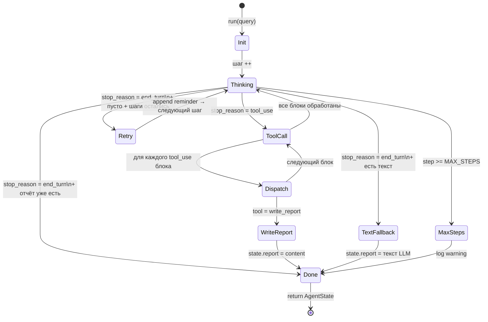

# Урок 5. Главный цикл — Orchestrator

**Файл:** `agent/orchestrator.py`

## Роль оркестратора

Orchestrator — это «дирижёр» агента. Он не принимает решений о том,
что исследовать (это делает LLM) и не знает деталей инструментов
(это знает ToolRegistry). Его единственная задача — управлять
циклом и обеспечивать соблюдение правил.

Это называется принципом **разделения ответственностей**:
- LLM думает → что делать
- ToolRegistry знает → как это сделать
- AgentState хранит → что уже было
- Orchestrator управляет → порядком и правилами

---

## Системный промпт

Перед началом каждой сессии LLM получает системный промпт — инструкции,
которые определяют её поведение:

```python
SYSTEM_PROMPT = """\
You are a research assistant. Your job is to research a topic and produce a report.

RULES — follow them strictly:
1. You MUST use tools. Do NOT answer from memory alone.
2. You MUST end every session by calling the write_report tool.
3. Never stop with a plain text response — always call a tool.
4. "RAG" means Retrieval-Augmented Generation (an AI technique), not anything else.

WORKFLOW:
Step 1 — Call search_web with a specific query to find sources.
Step 2 — Call fetch_pages on the most promising URLs (pick 2-4).
Step 3 — If any page is very long, call summarize_page on it.
Step 4 — Call write_report with a structured Markdown report and all sources.
"""
```

### Почему такой строгий промпт

Без чётких инструкций LLM может:
- Ответить на вопрос из памяти, не ища источники
- Написать отчёт как обычный текст, не вызвав `write_report`
- Зациклиться на поиске и никогда не написать отчёт

Чёткие правила в системном промпте — это программирование поведения модели.

---

## Диаграмма состояний цикла



## 5 инвариантов ReAct-цикла

Инвариант — это утверждение, которое должно быть истинным **всегда**,
при любых условиях. Это как контракт между разработчиком и системой.

```python
class Orchestrator:
    """
    Invariants (must hold after any change):
    1. Step limit enforced — exits after max_steps even without write_report
    2. Every tool dispatch logged at INFO level
    3. ToolError never crashes the loop — appended as tool result
    4. State is append-only — messages are never deleted
    5. write_report always terminates — exits loop immediately
    """
```

Почему это важно? Потому что агент работает в непредсказуемой среде
(сеть может упасть, LLM может вернуть неожиданный ответ). Инварианты
гарантируют, что агент всегда завершится корректно.

---

## Код цикла — разбор по частям

### Инициализация

```python
async def run(self, query: str) -> AgentState:
    state = AgentState(query=query)
    state.append_message(Message(role="user", content=f"Research topic: {query}"))

    tools = self.registry.get_schemas()   # схемы для LLM
```

### Главный цикл

```python
while state.step < self.max_steps:          # Инвариант 1: лимит шагов
    state.increment_step()
    log.info("react_step", step=state.step) # Инвариант 2: логирование

    response = await self.llm.complete(
        messages=state.to_api_messages(),
        tools=tools,
        system=SYSTEM_PROMPT,
    )

    # Добавляем ответ LLM в историю (Инвариант 4: append-only)
    state.append_message(Message(role="assistant", content=response["content"]))

    stop_reason = response.get("stop_reason", "")
```

### Обработка end_turn (LLM не вызвала инструмент)

```python
    if stop_reason == "end_turn":
        text_parts = [b["text"] for b in response["content"] if b.get("type") == "text"]

        if text_parts and not state.report:
            # LLM написала текст вместо вызова write_report — сохраняем как отчёт
            state.report = f"# Research: {query}\n\n" + "\n\n".join(text_parts)
            log.warning("fallback_report_from_text", ...)
            break

        if not state.report and state.step < self.max_steps:
            # Пустой ответ — напоминаем LLM что нужно написать отчёт
            log.warning("end_turn_no_content_retry", step=state.step)
            state.append_message(Message(
                role="user",
                content="You stopped without calling write_report. "
                        "You MUST call write_report now to finish the research."
            ))
            continue    # ← даём ещё одну попытку

        break
```

### Обработка tool_use (LLM вызывает инструменты)

```python
    if stop_reason != "tool_use":
        break   # неожиданный stop_reason

    tool_results = []
    done = False

    for block in response["content"]:
        if block.get("type") != "tool_use":
            continue

        result_str = await self._dispatch_tool(
            state, block["name"], block["input"], block["id"]
        )

        tool_results.append({
            "type": "tool_result",
            "tool_use_id": block["id"],
            "content": result_str,
        })

        if block["name"] == "write_report":
            done = True      # Инвариант 5: завершаем после write_report
            break

    # Добавляем результаты как одно сообщение user (требование Anthropic API)
    if tool_results:
        state.append_message(Message(role="user", content=tool_results))

    if done:
        break
```

### Почему все результаты в одном сообщении user

Anthropic API требует чередования `assistant` и `user` сообщений.
Нельзя послать два `user`-сообщения подряд. Если LLM вызвала несколько
инструментов за один шаг — все результаты упаковываются в один `user` блок.

---

## _dispatch_tool — безопасный вызов инструмента

```python
async def _dispatch_tool(self, state, tool_name, tool_input, tool_use_id) -> str:
    log.info("tool_dispatched", tool=tool_name, step=state.step)  # Инвариант 2

    try:
        result = await self.registry.dispatch(tool_name, **tool_input)

        if tool_name == "write_report":
            state.report = result.content
            for src in result.sources:
                state.add_source(Source(...))
            return f"Report written: {result.title} ({result.word_count} words)"

        if tool_name == "search_web" and isinstance(result, list):
            for r in result:
                state.add_source(Source(url=r["url"], title=r.get("title", "")))

        return json.dumps(result, ensure_ascii=False, default=str)

    except ToolError as e:
        log.warning("tool_error", tool=tool_name, error=str(e))  # Инвариант 3
        return f"Error executing {tool_name}: {e}"
```

Ключевое: `ToolError` **никогда не пробрасывается наверх**.
Ошибка превращается в строку и возвращается LLM как результат.
LLM видит «Error: rate limit» и может попробовать другой подход.

---

## Полный сценарий выполнения

```
Запрос: "RAG best practices"

Шаг 1:
  LLM → tool_use: search_web(query="RAG best practices 2024")
  ToolRegistry → search_web → [5 результатов]
  AgentState ← messages += [assistant, user/tool_result]
  AgentState ← sources += [5 URL]

Шаг 2:
  LLM → tool_use: fetch_pages(urls=["https://arxiv.org/...", ...])
  ToolRegistry → fetch_pages → [5 страниц с текстом]
  AgentState ← messages += [assistant, user/tool_result]

Шаг 3:
  LLM → tool_use: write_report(title="...", content="...", sources=[...])
  ToolRegistry → write_report → ReportResult
  AgentState ← report = "# RAG Best Practices\n\n..."
  done = True → break

Итог:
  AgentState.report = "# RAG Best Practices..."
  AgentState.sources = [5 источников]
  AgentState.step = 3
```

---

## Что происходит при переполнении шагов

```python
while state.step < self.max_steps:
    ...
else:
    # else у while выполняется когда условие стало False (не при break)
    log.warning("react_max_steps_reached", step=state.step)
```

Если за `MAX_STEPS` итераций агент не вызвал `write_report`:
- Цикл завершается (Инвариант 1)
- `state.report = None`
- `main.py` выводит «No report generated»

Это предохранитель от бесконечного зацикливания (и бесконечных трат на API).

---

## Что дальше

Всё написано. Как убедиться, что работает правильно?
[09-testing.md](09-testing.md)
