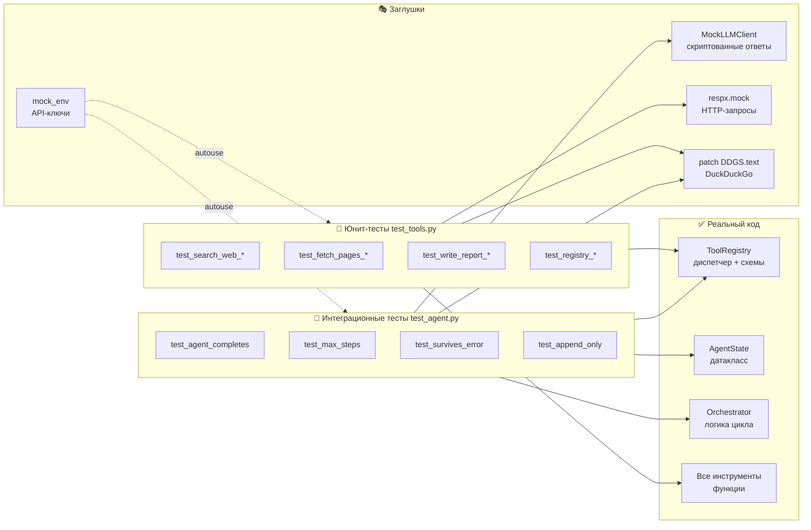

# Урок 6. Тестирование агента

**Папка:** `tests/`

## Зачем тестировать агента

AI-агент — это нетривиальная система: LLM-вызовы, HTTP-запросы,
инструменты, циклы. Без тестов:

- Изменение одного компонента может сломать другой незаметно
- Отладка реального запуска занимает деньги и время (API-вызовы платные)
- Невозможно быстро проверить что «ничего не сломалось»

Хорошие тесты позволяют менять код уверенно.

---

## Стратегия тестирования



## Два уровня тестов

### Юнит-тесты (`tests/test_tools.py`)

Тестируют каждый инструмент **в изоляции**. Внешние зависимости
(HTTP, API) заменяются заглушками (моками).

**Принцип:** тест должен проверять только один компонент.
Если тест `test_fetch_pages` падает — проблема в `fetch_pages`,
а не в DuckDuckGo или Anthropic.

### Интеграционные тесты (`tests/test_agent.py`)

Тестируют **поведение системы целиком**: как оркестратор обрабатывает
разные ответы LLM, соблюдаются ли инварианты.

Реальные LLM-вызовы заменяются `MockLLMClient` — объектом, который
возвращает заранее заготовленные ответы.

---

## Инфраструктура тестов

### pytest + anyio

```python
@pytest.mark.anyio
async def test_something():
    result = await some_async_function()
    assert result == expected
```

`anyio` позволяет тестировать асинхронный код. Декоратор `@pytest.mark.anyio`
говорит pytest запустить тест в event loop.

### conftest.py — общие фикстуры

```python
# conftest.py — выполняется автоматически перед всеми тестами
```

**Что такое фикстура?** Функция с `@pytest.fixture` — это «поставщик»
объекта для тестов. pytest автоматически вызывает её и передаёт результат
в тест как аргумент.

```python
@pytest.fixture
def mock_llm_client():
    return MockLLMClient([
        _tool_use_response("search_web", {"query": "test"}, "tu_001"),
        _tool_use_response("write_report", {"title": "T", "content": "C"}, "tu_002"),
    ])

async def test_agent(mock_llm_client):    # ← pytest передаёт готовый объект
    orchestrator = Orchestrator(llm=mock_llm_client)
    state = await orchestrator.run("test")
    assert state.report is not None
```

---

## MockLLMClient — фиктивный LLM

```python
class MockLLMClient:
    def __init__(self, responses=None):
        self._responses = list(responses or [])
        self._call_count = 0

    async def complete(self, messages, tools, system=""):
        self._call_count += 1
        if not self._responses:
            # По умолчанию: немедленно завершить через write_report
            return _tool_use_response("write_report", {
                "title": "Test Report",
                "content": "# Test\n\nDefault mock report.",
                "sources": [],
            }, f"tu_default_{self._call_count}")
        return self._responses.pop(0)   # возвращает следующий заготовленный ответ
```

Это позволяет точно управлять поведением «LLM» в тестах:
задать сколько шагов, какие инструменты вызывать, что вернуть.

### Формат ответа-заглушки

```python
def _tool_use_response(tool_name, tool_input, tool_use_id="tu_001"):
    return {
        "id": f"msg_{tool_use_id}",
        "type": "message",
        "role": "assistant",
        "content": [{
            "type": "tool_use",
            "id": tool_use_id,
            "name": tool_name,
            "input": tool_input,
        }],
        "stop_reason": "tool_use",
        "usage": {"input_tokens": 100, "output_tokens": 50},
    }
```

---

## Автоматические фикстуры (autouse=True)

```python
@pytest.fixture(autouse=True)   # применяется ко ВСЕМ тестам автоматически
def mock_env(monkeypatch):
    """Инжектируем тестовые ключи, чтобы settings не упал."""
    monkeypatch.setenv("ANTHROPIC_API_KEY", "sk-ant-test-key")
    from config.settings import settings
    monkeypatch.setattr(settings, "ANTHROPIC_API_KEY", "sk-ant-test-key")


@pytest.fixture(autouse=True)
def mock_ddg():
    """Блокируем реальные вызовы DuckDuckGo во всех тестах."""
    fake_results = [
        {"href": "https://example.com", "title": "Example", "body": "result"},
    ]
    with patch("ddgs.DDGS.text", return_value=fake_results):
        yield
```

Без `mock_ddg` тесты делали бы реальные запросы в интернет —
они были бы медленными, нестабильными и зависели от сети.

---

## Юнит-тесты инструментов

### Тест поиска

```python
@pytest.mark.anyio
async def test_search_web_returns_results():
    mock_raw = [{"href": "https://example.com", "title": "Example", "body": "text"}]

    with patch("ddgs.DDGS.text", return_value=mock_raw):
        from tools.search import search_web
        results = await search_web("test query", max_results=1)

    assert len(results) == 1
    assert results[0]["url"] == "https://example.com"
    assert results[0]["snippet"] == "text"
```

`patch("ddgs.DDGS.text", ...)` временно заменяет реальную функцию
DuckDuckGo на заглушку. После теста — автоматически восстанавливается.

### Тест загрузки страниц с мокированным HTTP

```python
@pytest.mark.anyio
@respx.mock             # ← мокируем все HTTP-запросы
async def test_fetch_pages_extracts_text(sample_html):
    respx.get("https://example.com/").mock(
        return_value=httpx.Response(200, text=sample_html)
    )

    from tools.fetch import fetch_pages
    results = await fetch_pages(["https://example.com/"])

    assert len(results) == 1
    assert "RAG Best Practices" in results[0]["content"]
    assert "alert(" not in results[0]["content"]  # скрипт удалён
```

`respx` — библиотека для мокирования httpx. С `@respx.mock` все
HTTP-запросы перехватываются; реальные запросы в интернет не идут.

### Тест обработки ошибок

```python
@pytest.mark.anyio
@respx.mock
async def test_fetch_pages_handles_failed_url():
    respx.get("https://bad-url.example/").mock(
        side_effect=httpx.ConnectError("connection refused")
    )

    results = await fetch_pages(["https://bad-url.example/"])

    assert results[0].get("error") is not None  # ошибка есть
    # но исключение не выброшено — функция не упала
```

### Тест написания отчёта

```python
@pytest.mark.anyio
async def test_write_report_returns_formatted_markdown():
    result = await write_report(
        title="Test Report",
        content="# Test\n\nSome findings.",
        sources=[{"url": "https://example.com", "title": "Example"}],
    )

    assert result.title == "Test Report"
    assert "## References" in result.content      # раздел добавлен
    assert "https://example.com" in result.content
    assert result.word_count > 0
```

---

## Интеграционные тесты цикла

### Базовый сценарий: поиск → отчёт

```python
@pytest.mark.anyio
async def test_agent_completes_with_write_report(mock_llm_client):
    orchestrator = Orchestrator(llm=mock_llm_client)
    state = await orchestrator.run("test research topic")

    assert state.report is not None
    assert "Test Report" in state.report
```

### Инвариант 1: лимит шагов

```python
@pytest.mark.anyio
async def test_agent_respects_max_steps():
    # LLM постоянно ищет, никогда не пишет отчёт
    endless_search = MockLLMClient([
        _tool_use_response("search_web", {"query": f"q{i}"}, f"tu_{i}")
        for i in range(20)
    ])

    orchestrator = Orchestrator(llm=endless_search, max_steps=3)
    state = await orchestrator.run("infinite loop test")

    assert state.step <= 3     # не более 3 шагов
    assert state.report is None  # отчёт не написан без write_report
```

### Инвариант 3: ToolError не ломает цикл

```python
@pytest.mark.anyio
async def test_agent_survives_tool_error():
    registry = ToolRegistry()

    # Делаем search_web бросающим ошибку
    original_dispatch = registry.dispatch
    async def patched_dispatch(tool_name, **kwargs):
        if tool_name == "search_web":
            raise ToolError("simulated failure", tool_name="search_web")
        return await original_dispatch(tool_name, **kwargs)
    registry.dispatch = patched_dispatch

    client = MockLLMClient([
        _tool_use_response("search_web", {"query": "test"}, "tu_001"),
        _tool_use_response("write_report", {
            "title": "Recovery", "content": "# Recovery\n\n...", "sources": []
        }, "tu_002"),
    ])

    orchestrator = Orchestrator(llm=client, registry=registry)
    state = await orchestrator.run("error test")

    assert state.report is not None   # цикл продолжился несмотря на ошибку
    assert "Recovery" in state.report
```

---

## Что мы НЕ мокируем

| Что | Почему не мокируем |
|-----|-------------------|
| `ToolRegistry` | Тестируем реальный диспетчер — чтобы поймать несоответствия схем |
| `AgentState` | Обычный датакласс, создаём напрямую |
| `write_report` | Детерминированная функция, не нужен мок |

---

## Запуск тестов

```bash
# Все тесты
pytest tests/ -v

# Только юнит-тесты инструментов
pytest tests/test_tools.py -v

# Только интеграционные тесты
pytest tests/test_agent.py -v

# Остановиться на первой ошибке
pytest tests/ -x

# С подробным выводом при ошибке
pytest tests/ -v --tb=short
```

---

## Что дальше

Агент написан и протестирован. Посмотрим как добавить новый инструмент:
[10-add-tool.md](10-add-tool.md)
