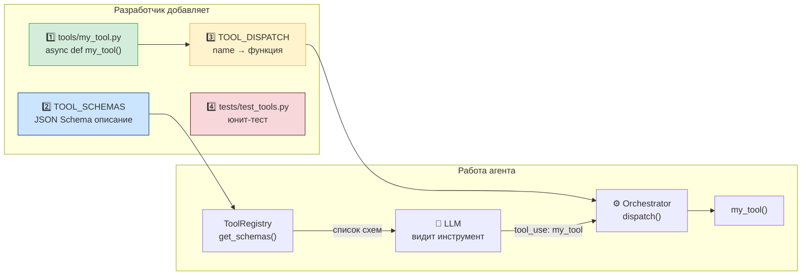

# Бонус. Как добавить новый инструмент

Одно из главных преимуществ архитектуры ReAct — лёгкое расширение.
Чтобы добавить новый инструмент, не нужно трогать Orchestrator или LLMClient.

Добавим инструмент `extract_keywords` — выделяет ключевые слова из текста
(учебный пример, чтобы разобрать все шаги).

---

## Как инструмент попадает в агента



## Чеклист добавления инструмента

- [ ] Создать файл `tools/your_tool.py`
- [ ] Написать `async def your_tool(...)` с `ToolError` при ошибках
- [ ] Добавить JSON Schema в `TOOL_SCHEMAS` в `tools/registry.py`
- [ ] Зарегистрировать функцию в `TOOL_DISPATCH`
- [ ] Написать тест в `tests/test_tools.py`
- [ ] Проверить: `python3 -c "from tools.registry import ToolRegistry; print(ToolRegistry().list_tools())"`

---

## Шаг 1: Создать файл инструмента

Создайте `tools/extract_keywords.py`:

```python
"""extract_keywords — извлечь ключевые слова из текста.

Использует простую эвристику (частота слов) без внешних зависимостей.
"""

from __future__ import annotations

import re
from collections import Counter

import structlog

from tools.registry import ToolError

log = structlog.get_logger(__name__)


async def extract_keywords(
    text: str,
    max_keywords: int = 10,
) -> list[str]:
    """Извлечь ключевые слова из текста.

    Args:
        text: Текст для анализа.
        max_keywords: Максимальное количество ключевых слов (1-20).

    Returns:
        Список ключевых слов по убыванию частоты.

    Raises:
        ToolError: Если текст пустой или слишком короткий.
    """
    if not text or len(text.strip()) < 10:
        raise ToolError("Text is too short to extract keywords", tool_name="extract_keywords")

    # Нормализуем: нижний регистр, только буквы
    words = re.findall(r'\b[a-zA-Zа-яА-Я]{4,}\b', text.lower())

    # Стоп-слова (шумовые слова)
    stop_words = {
        "this", "that", "with", "from", "have", "will", "been",
        "they", "their", "what", "when", "where", "which", "were",
        "также", "этот", "того", "этой", "которые",
    }

    filtered = [w for w in words if w not in stop_words]

    if not filtered:
        raise ToolError("No keywords found in text", tool_name="extract_keywords")

    # Топ-N по частоте
    counter = Counter(filtered)
    keywords = [word for word, _ in counter.most_common(max_keywords)]

    log.info("keywords_extracted", count=len(keywords), text_length=len(text))
    return keywords
```

### Что важно в этом файле

1. **`async def`** — даже без async-операций внутри
2. **`ToolError`** — только этот тип исключения, не `ValueError` или `RuntimeError`
3. **`structlog`** — не `print()`
4. **Type hints** на всех параметрах и возвращаемом значении
5. **Docstring** с описанием параметров — это помогает понять что делает инструмент

---

## Шаг 2: Добавить JSON Schema в registry.py

Откройте `tools/registry.py` и добавьте схему в список `TOOL_SCHEMAS`:

```python
TOOL_SCHEMAS: list[dict[str, Any]] = [
    # ... существующие инструменты ...

    {
        "name": "extract_keywords",
        "description": (
            "Extract key terms and concepts from text content. "
            "Use this to identify the main topics discussed on a page "
            "before deciding which content to include in the report."
        ),
        "input_schema": {
            "type": "object",
            "properties": {
                "text": {
                    "type": "string",
                    "description": "The text content to analyze for keywords.",
                },
                "max_keywords": {
                    "type": "integer",
                    "description": "Maximum number of keywords to return (1-20). Default: 10.",
                    "default": 10,
                },
            },
            "required": ["text"],  # max_keywords — опциональный
        },
    },
]
```

### Правила написания хорошей схемы

- **`description` инструмента**: объясните КОГДА использовать, не только ЧТО делает
- **`description` каждого параметра**: укажите формат, ограничения, примеры
- **`required`**: только действительно обязательные параметры
- Необязательные параметры с `default` в description, не в схеме

---

## Шаг 3: Зарегистрировать в TOOL_DISPATCH

В той же `tools/registry.py`, в функции `_register_tools()`:

```python
def _register_tools() -> None:
    try:
        from tools.search import search_web
        from tools.fetch import fetch_pages
        from tools.summarize import summarize_page
        from tools.report import write_report
        from tools.extract_keywords import extract_keywords    # ← добавить

        TOOL_DISPATCH.update({
            "search_web":        search_web,
            "fetch_pages":       fetch_pages,
            "summarize_page":    summarize_page,
            "write_report":      write_report,
            "extract_keywords":  extract_keywords,             # ← добавить
        })
    except ImportError as e:
        log.warning("tool_import_failed", error=str(e))
```

---

## Шаг 4: Написать тест

В `tests/test_tools.py` добавьте:

```python
# ── extract_keywords ──────────────────────────────────────────────────────────

@pytest.mark.anyio
async def test_extract_keywords_returns_list():
    """extract_keywords возвращает список строк."""
    from tools.extract_keywords import extract_keywords

    text = "Retrieval-Augmented Generation combines retrieval with generation models."
    result = await extract_keywords(text, max_keywords=5)

    assert isinstance(result, list)
    assert len(result) <= 5
    assert all(isinstance(k, str) for k in result)


@pytest.mark.anyio
async def test_extract_keywords_raises_on_empty():
    """extract_keywords бросает ToolError на пустом тексте."""
    from tools.extract_keywords import extract_keywords
    from tools.registry import ToolError

    with pytest.raises(ToolError):
        await extract_keywords("")


@pytest.mark.anyio
async def test_extract_keywords_via_registry():
    """extract_keywords доступен через ToolRegistry.dispatch."""
    from tools.registry import ToolRegistry

    registry = ToolRegistry()
    result = await registry.dispatch(
        "extract_keywords",
        text="Machine learning models learn from data.",
    )
    assert isinstance(result, list)
```

---

## Шаг 5: Проверить

```bash
# Инструмент зарегистрирован
python3 -c "from tools.registry import ToolRegistry; print(ToolRegistry().list_tools())"
# ['search_web', 'fetch_pages', 'summarize_page', 'write_report', 'extract_keywords']

# Тесты проходят
pytest tests/test_tools.py -v -k "keyword"
# test_extract_keywords_returns_list PASSED
# test_extract_keywords_raises_on_empty PASSED
# test_extract_keywords_via_registry PASSED

# Все тесты не сломались
pytest tests/ -x -q
# 35 passed
```

---

## Как LLM узнаёт об инструменте

При каждом вызове Orchestrator передаёт в LLM полный список схем:

```python
tools = self.registry.get_schemas()
response = await self.llm.complete(messages=..., tools=tools, ...)
```

LLM видит новый инструмент `extract_keywords` с его описанием и может
начать его использовать. Никаких изменений в Orchestrator не нужно.

---

## Добавление алиасов для opensource-моделей (опционально)

Если вы планируете использовать Ollama или другие opensource-модели,
добавьте известные вариации имён аргументов в `_ARG_ALIASES`:

```python
_ARG_ALIASES = {
    # ... существующие ...

    "extract_keywords": {
        "content":  "text",       # модель может написать content вместо text
        "document": "text",
        "num_keywords": "max_keywords",
        "top_n":    "max_keywords",
        "n":        "max_keywords",
    },
}
```

---

## Итог

Добавление инструмента занимает ~15 минут и не требует изменений
в оркестраторе или LLM-клиенте. Это и есть сила хорошей архитектуры.

Если хотите добавить инструмент для работы с базами данных, отправки email,
работы с PDF или вызова других API — шаги всегда одни и те же.
