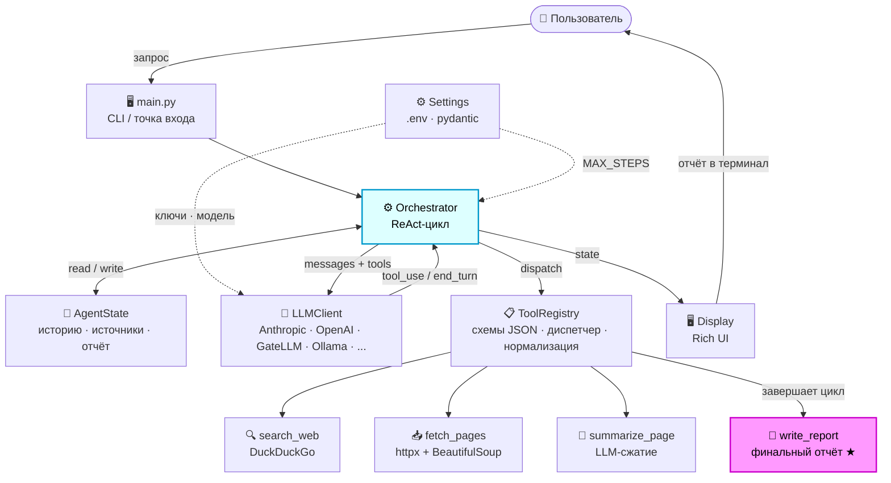

# Документация Research Agent

Это учебный курс по построению автономного AI-агента на Python с нуля.
Проект **Research Agent** — реальный рабочий агент, который самостоятельно
исследует любую тему: ищет информацию в интернете, загружает страницы
и синтезирует структурированный отчёт.

Документация устроена как последовательность уроков: от концепций до
готового кода, который вы можете запустить.

---

## Верхнеуровневая архитектура



---

## Путь обучения

```
01-concepts.md       → Что такое AI-агент и паттерн ReAct
02-architecture.md   → Архитектура проекта и поток данных
03-setup.md          → Установка и настройка окружения
04-agent-state.md    → Урок 1: Память агента (AgentState)
05-llm-client.md     → Урок 2: Клиент языковой модели (LLM Client)
06-tools.md          → Урок 3: Инструменты агента (Tools)
07-registry.md       → Урок 4: Реестр инструментов (ToolRegistry)
08-orchestrator.md   → Урок 5: Цикл ReAct (Orchestrator)
09-testing.md        → Урок 6: Тестирование агента
10-add-tool.md       → Бонус: Как добавить новый инструмент
```

---

## Для кого эта документация

- Вы знаете Python на базовом или среднем уровне
- Вы слышали об LLM и хотите понять, как строятся агенты
- Вам не нужен опыт в ML — агент использует готовые API

---

## Итоговый результат

После прохождения всех уроков у вас будет:

- Полное понимание того, как работает ReAct-агент изнутри
- Рабочий агент с поддержкой 9 LLM-провайдеров
- Набор тестов для всех компонентов
- База для создания собственного агента под любую задачу

---

## Быстрый старт (если хочется сразу запустить)

```bash
git clone <repo-url>
cd research-agent
python3 -m venv .venv && source .venv/bin/activate
pip install -e ".[dev]"

# Настроить .env (см. 03-setup.md)
cp .env.example .env

python main.py "Лучшие практики построения RAG-систем"
```
