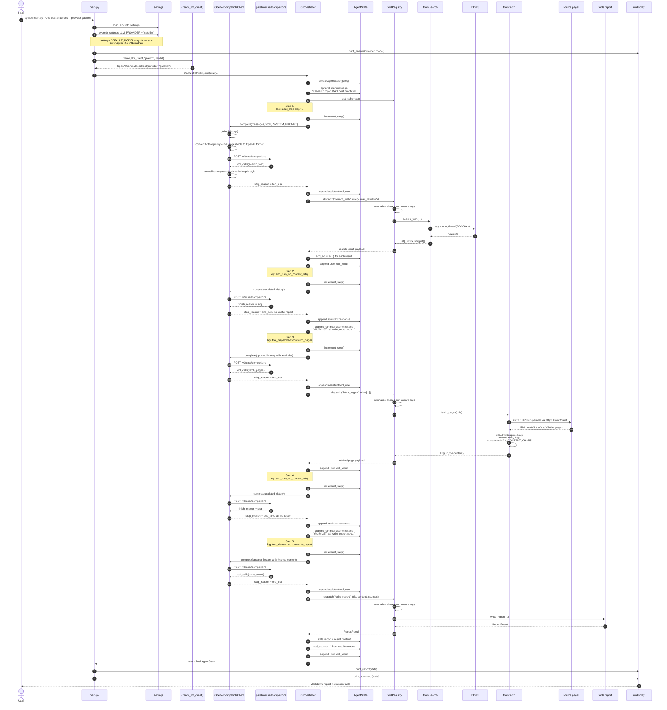

# Common Diagram

Ниже показан реальный путь вызовов для запуска:

```bash
python main.py "RAG best practices" --provider gatellm
```

Предположение для этого сценария: `--model` не передан, поэтому модель берётся из `.env` через `settings.DEFAULT_MODEL`. В вашем логе это `qwen/qwen-2.5-72b-instruct`.

## 1. Большая карта модулей и вызовов

```mermaid
flowchart TD
    CMD["CLI command<br/>python main.py &quot;RAG best practices&quot; --provider gatellm"]

    subgraph ENTRY["CLI / startup"]
        MAIN["main.py<br/>main() -> _run(args)"]
        SETTINGS["config/settings.py<br/>settings singleton<br/>.env + CLI overrides"]
        DISPLAY["ui/display.py<br/>print_banner()<br/>print_report()<br/>print_summary()"]
    end

    subgraph AGENT["agent/"]
        FACTORY["llm_client.py<br/>create_llm_client()"]
        OAI["OpenAICompatibleClient<br/>provider='gatellm'"]
        TRIM["_trim_history(messages)"]
        REQMAP["_anthropic_messages_to_openai()<br/>_anthropic_tools_to_openai()"]
        RESPMAP["_openai_response_to_anthropic()"]
        ORCH["orchestrator.py<br/>Orchestrator.run(query)"]
        STATE["state.py<br/>AgentState<br/>messages / sources / step / report"]
    end

    subgraph REGISTRY["tools/registry.py"]
        REG["ToolRegistry"]
        SCHEMA["get_schemas()<br/>search_web / fetch_pages / summarize_page / write_report"]
        NORMALIZE["_normalize_arg_names()<br/>_coerce_args()"]
    end

    subgraph TOOLS["tools/"]
        SEARCH["search.py<br/>search_web()"]
        FETCH["fetch.py<br/>fetch_pages()"]
        SUMM["summarize.py<br/>summarize_page()"]
        REPORT["report.py<br/>write_report()"]
        RESULT["ReportResult<br/>title / content / sources / word_count"]
    end

    subgraph EXTERNAL["external calls"]
        GATE["GateLLM API<br/>POST https://gatellm.ru/v1/chat/completions"]
        DDG["ddgs / DDGS.text()<br/>run via asyncio.to_thread()"]
        WEBSEARCH["search endpoints behind ddgs<br/>Wikipedia / Yahoo / Mojeek / ..."]
        HTTPX["httpx.AsyncClient<br/>asyncio.gather()"]
        URLS["Fetched URLs<br/>ACL / arXiv / Chitika / ..."]
        BS4["BeautifulSoup<br/>clean text + truncate to 3000 chars"]
        ANTH["anthropic.AsyncAnthropic<br/>optional summarize path"]
    end

    CMD --> MAIN
    MAIN --> SETTINGS
    SETTINGS -.->|LLM_PROVIDER=gatellm<br/>DEFAULT_MODEL from .env<br/>MAX_STEPS / REQUEST_TIMEOUT| MAIN
    MAIN --> DISPLAY
    MAIN --> FACTORY
    FACTORY --> OAI
    MAIN --> ORCH
    ORCH <--> STATE
    ORCH --> REG
    REG --> SCHEMA

    ORCH -->|complete(messages, tools, SYSTEM_PROMPT)| OAI
    OAI --> TRIM
    OAI --> REQMAP
    REQMAP --> GATE
    GATE --> RESPMAP
    RESPMAP --> ORCH

    REG -->|dispatch(tool_name, **kwargs)| NORMALIZE

    NORMALIZE --> SEARCH
    SEARCH --> DDG
    DDG --> WEBSEARCH
    SEARCH -->|list[{url,title,snippet}]| REG
    REG -->|search results| ORCH
    ORCH -->|add_source() for search results| STATE

    NORMALIZE --> FETCH
    FETCH --> HTTPX
    HTTPX --> URLS
    URLS --> BS4
    BS4 --> FETCH
    FETCH -->|list[{url,title,content}]| REG
    REG -->|fetched page content| ORCH

    NORMALIZE -. optional .-> SUMM
    SUMM -. direct provider bypass .-> ANTH
    SUMM -->|summary text| REG
    REG -->|summary| ORCH

    NORMALIZE --> REPORT
    REPORT --> RESULT
    RESULT --> REG
    REG -->|ReportResult| ORCH
    ORCH -->|state.report = result.content| STATE

    ORCH -->|return AgentState| MAIN
    MAIN -->|render final output| DISPLAY

    classDef entry fill:#e3f2fd,stroke:#1565c0,stroke-width:1px,color:#000;
    classDef core fill:#e8f5e9,stroke:#2e7d32,stroke-width:1px,color:#000;
    classDef tool fill:#fff3e0,stroke:#ef6c00,stroke-width:1px,color:#000;
    classDef ext fill:#fce4ec,stroke:#ad1457,stroke-width:1px,color:#000;

    class MAIN,SETTINGS,DISPLAY entry;
    class FACTORY,OAI,TRIM,REQMAP,RESPMAP,ORCH,STATE,REG,SCHEMA,NORMALIZE core;
    class SEARCH,FETCH,SUMM,REPORT,RESULT tool;
    class GATE,DDG,WEBSEARCH,HTTPX,URLS,BS4,ANTH ext;
```

## 2. Точный сценарий для вашего лога



## 3. Как читать ваш лог

- `INFO:httpx: HTTP Request: POST https://gatellm.ru/v1/chat/completions` — это `OpenAICompatibleClient.complete()`.
- `INFO:primp:response: ... wikipedia / yahoo / mojeek ...` — это внутренние HTTP-вызовы библиотеки `ddgs`, которую использует `tools/search.py`.
- `INFO:httpx: HTTP Request: GET https://...` — это `tools/fetch.py`, который параллельно грузит страницы через `httpx.AsyncClient`.
- `WARNING:agent.orchestrator: end_turn_no_content_retry` — модель завершила ход без `write_report`, и `Orchestrator` добавил в историю жёсткое reminder-сообщение.
- `INFO:tools.report: report_written` — `write_report()` оформил итоговый Markdown и при необходимости добавил `References`.
- `INFO:agent.orchestrator: react_done reason=write_report` — оркестратор увидел терминальный инструмент и сразу завершил цикл.

## 4. Что важно заметить

- В этом конкретном прогоне фактический путь был таким: `search_web -> retry -> fetch_pages -> retry -> write_report`.
- `summarize_page` есть в схеме инструментов, но в вашем логе не использовался.
- `summarize_page` сейчас вызывает Anthropic напрямую, даже если основной провайдер в сессии — `gatellm`.
- Источники добавляются в `state.sources` дважды с разных сторон: после `search_web` и после `write_report`, но `AgentState.add_source()` дедуплицирует их по URL.
